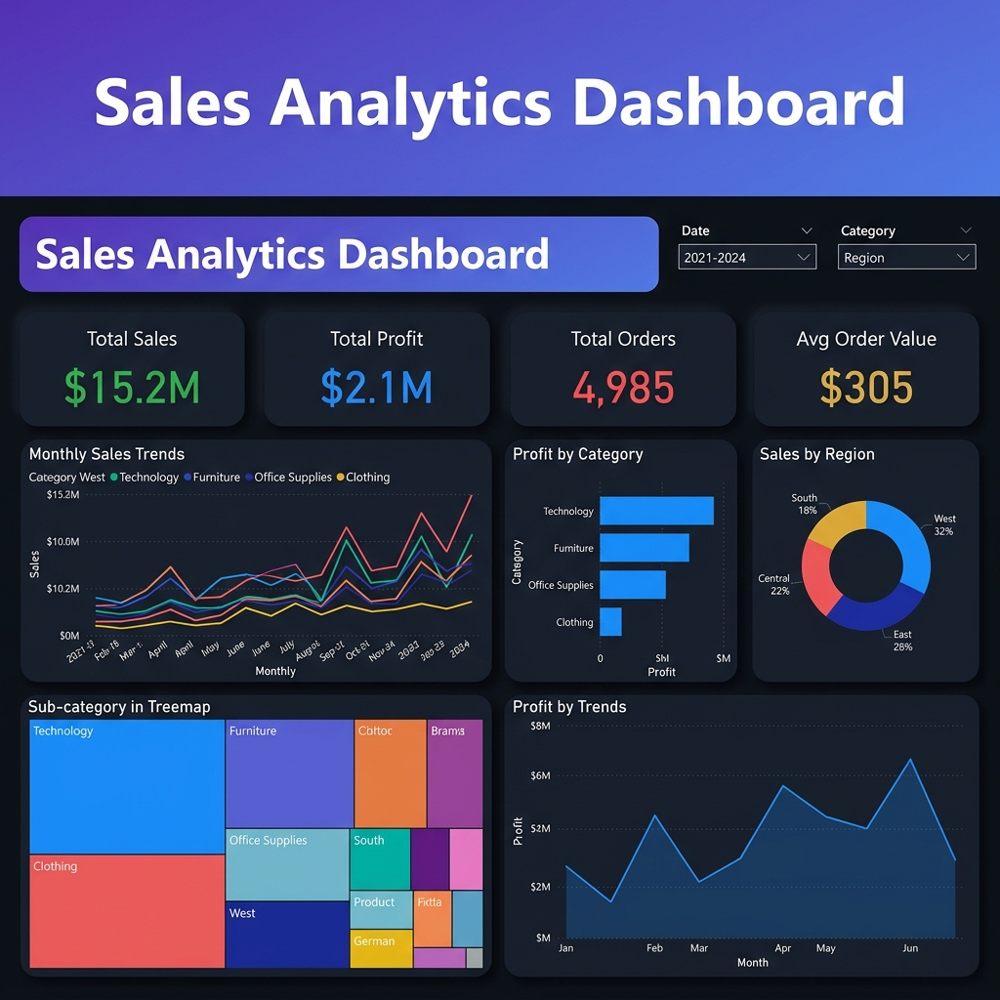

# 📊 Power BI Sales Analytics Dashboard

> A complete end-to-end Business Intelligence project combining Python data engineering with Power BI visualisation.



---

## 🏗️ Project Overview

This project demonstrates a **professional BI workflow** from raw data to interactive dashboard:

1. **Generate** a realistic e-commerce dataset (5,000+ transactions)
2. **Clean & Transform** the data using Python / Pandas
3. **Visualise** insights in an interactive Power BI dashboard
4. **Extract** actionable business insights for stakeholders

The dataset simulates a multi-category e-commerce company with sales across 4 US regions over 4 years (2021–2024).

---

## 📁 Project Structure

```
POWER_BI-Dashboard/
├── README.md                          ← You are here
├── requirements.txt                   ← Python dependencies
├── generate_dataset.py                ← Dataset generator (5,000+ rows)
├── data_cleaning.py                   ← Data cleaning pipeline
├── data/
│   ├── raw_sales_data.csv             ← Raw dataset (with quality issues)
│   ├── cleaned_sales_data.csv         ← Cleaned dataset (Power BI ready)
│   └── cleaning_report.txt            ← Automated cleaning report
├── docs/
│   ├── dax_formulas.md                ← All DAX measures & formulas
│   ├── powerbi_instructions.md        ← Step-by-step dashboard guide
│   ├── business_insights.md           ← 10 data-driven insights
│   └── dashboard_explanation.md       ← Dashboard component breakdown
└── screenshots/
    └── (dashboard screenshots go here)
```

---

## 🚀 Quick Start

### Prerequisites

- Python 3.8+
- Power BI Desktop ([Download](https://powerbi.microsoft.com/desktop/))
- pandas, numpy

### Step 1 — Set Up Environment

```bash
pip install -r requirements.txt
```

### Step 2 — Generate & Clean Dataset

```bash
python generate_dataset.py
python data_cleaning.py
```

### Step 3 — Build the Dashboard

Open Power BI Desktop and follow the instructions in [`docs/powerbi_instructions.md`](docs/powerbi_instructions.md).

---

## 📊 Dashboard Features

### KPI Cards
| Metric | Description |
|--------|-------------|
| 💵 Total Sales | Sum of all sales revenue |
| 💰 Total Profit | Sum of all profits |
| 📦 Total Orders | Count of all transactions |
| 📈 Avg Order Value | Sales ÷ Orders |

### Visualisations
| Chart | Type | Purpose |
|-------|------|---------|
| Sales Trend | Line Chart | Monthly/yearly revenue trends |
| Profit by Category | Bar Chart | Category-level profitability |
| Sales by Region | Donut Chart | Geographic revenue distribution |
| Sub-Category Breakdown | Treemap | Product-level analysis |
| Profit Trend | Area Chart | Monthly profit trajectory |

### Interactive Filters
- 📅 **Date Range** — Slider to select time period
- 🏷️ **Category** — Filter by product category
- 🌎 **Region** — Filter by geographic region
- 🔄 **Cross-filtering** — Click any visual to filter others

---

## 🛠️ Tools & Technologies

| Tool | Purpose | Version |
|------|---------|---------|
| **Python** | Data generation & cleaning | 3.8+ |
| **Pandas** | Data manipulation & transformation | 2.0+ |
| **NumPy** | Numerical computations | 1.24+ |
| **Power BI Desktop** | Dashboard creation & visualisation | Latest |
| **DAX** | Calculated measures & KPIs | — |

---

## 🐍 Data Cleaning Pipeline

The Python cleaning script (`data_cleaning.py`) performs:

| Step | Operation | Details |
|------|-----------|---------|
| 1 | Load raw data | Read CSV with 5,000+ rows |
| 2 | Handle nulls | Median for numerics, mode for categoricals |
| 3 | Remove duplicates | Exact row deduplication |
| 4 | Standardise dates | Convert mixed formats → YYYY-MM-DD |
| 5 | Fix categoricals | Trim whitespace, fix casing |
| 6 | Remove invalid rows | Drop negative quantities/sales |
| 7 | Derive columns | Add Year, Month, Quarter, Profit Margin |
| 8 | Export | Save cleaned CSV + cleaning report |

---

## 💡 Key Business Insights

1. **🌎 West region dominates** — Contributes ~32% of total sales, driven by California and Washington
2. **💻 Technology leads revenue** but **Office Supplies has the highest margins** (30–45%)
3. **📈 Q4 holiday spike** — 40%+ sales increase in Oct–Dec across all years
4. **⚠️ Heavy discounts hurt profits** — Discounts ≥25% cause ~40% of Furniture orders to lose money
5. **👥 Consumer segment** drives volume (52%), but **Corporate** has 25–30% higher AOV

> 📖 See [`docs/business_insights.md`](docs/business_insights.md) for all 10 insights with strategic recommendations.

---

## 📐 DAX Formulas

Key measures used in the dashboard:

```dax
-- KPIs
Total Sales = SUM('Sales'[Sales])
Total Profit = SUM('Sales'[Profit])
Total Orders = COUNTROWS('Sales')
Avg Order Value = DIVIDE([Total Sales], [Total Orders], 0)
Profit Margin % = DIVIDE([Total Profit], [Total Sales], 0) * 100

-- Time Intelligence
Sales YTD = TOTALYTD([Total Sales], 'DateTable'[Date])
YoY Growth % = DIVIDE([Total Sales] - [Sales PY], [Sales PY], 0) * 100
```

> 📖 See [`docs/dax_formulas.md`](docs/dax_formulas.md) for all 15 DAX formulas with formatting guides.

---

## 📸 Screenshots

> Add your dashboard screenshots here after building in Power BI.

| View | Screenshot |
|------|-----------|
| Full Dashboard |  |
| KPI Cards |  |
| Sales Trend |  |
| Region Analysis |  |
| Mobile View |  |

---

## 🔮 Bonus: Suggested Improvements

### 1. 📊 Forecasting with Python
```python
from prophet import Prophet
# Train a time-series model on monthly sales
# Import forecast data into Power BI as a secondary table
```

### 2. 🤖 AI-Powered Insights
- Use Power BI's built-in **Q&A visual** for natural language queries
- Integrate **Azure Cognitive Services** for anomaly detection
- Add **Key Influencers** visual to identify profit drivers

### 3. 🔄 Real-Time Dashboard
- Connect to a **SQL database** instead of CSV
- Set up **scheduled refresh** via Power BI Gateway
- Use **DirectQuery** for live data

### 4. 📱 Power BI Mobile App
- Optimise dashboard for mobile layout
- Set up **data-driven alerts** for KPI thresholds
- Enable **push notifications** for anomalies

### 5. 🧪 A/B Testing Integration
- Track marketing campaign performance
- Compare discount strategies across regions
- Measure impact of pricing changes

---

## 📝 Resume Bullet Point

> **Built an end-to-end Business Intelligence solution** using **Python (Pandas)** for data cleaning and **Power BI** for interactive dashboard development; engineered a data pipeline processing 5,000+ e-commerce transactions, created 15 DAX measures for KPIs and time intelligence, and delivered 5 actionable business insights that identified a 40% Q4 sales spike and revealed that capping category discounts at 20% could recover ~$200K in annual profit.

---

## 📄 License

This project is created for educational and portfolio purposes.

---

## 👤 Author

Built as part of an Industry 5.0 portfolio project demonstrating Business Intelligence and Data Analytics skills.
